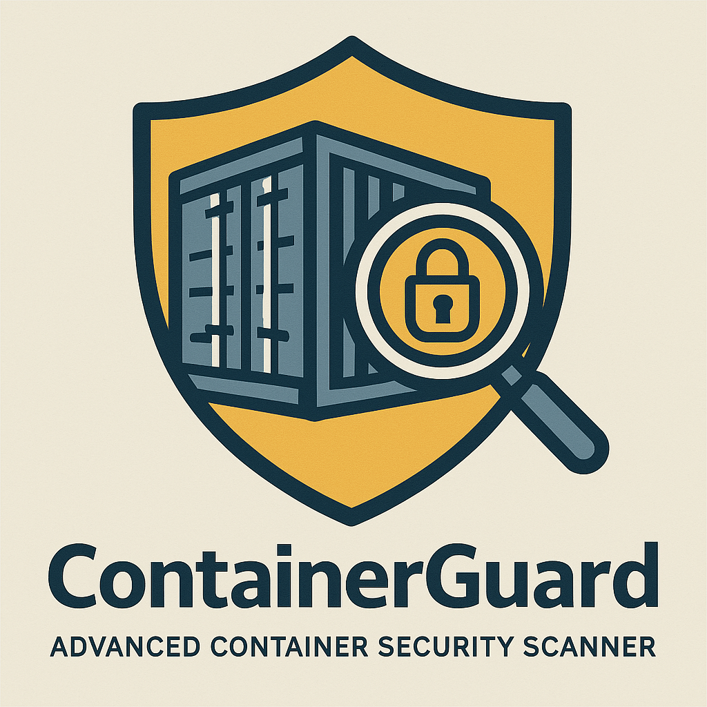
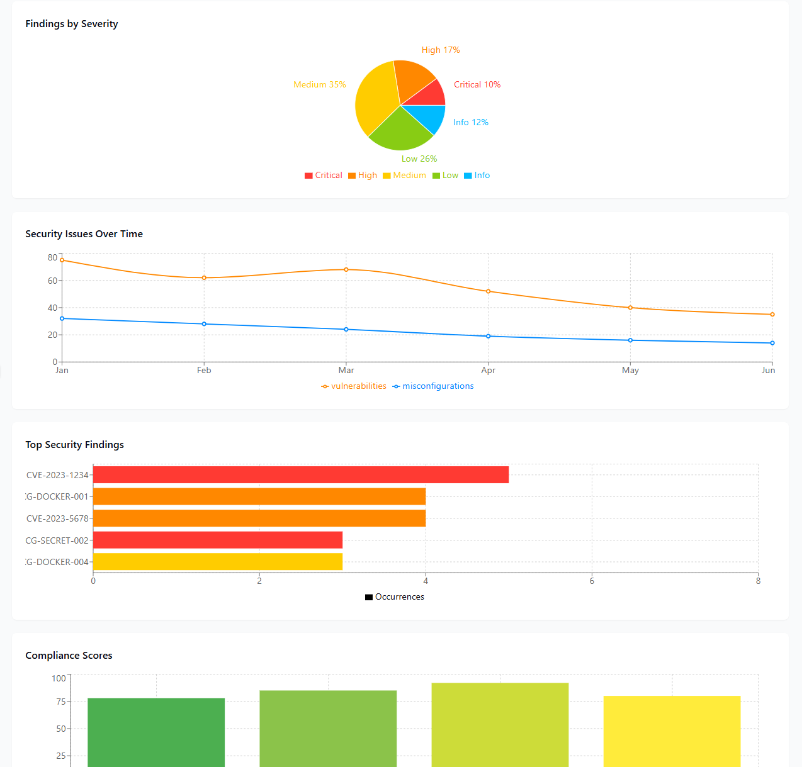

# ContainerGuard: Advanced Container Security Scanner



[](https://github.com/yourusername/containerguard/actions)
[](LICENSE)
[](https://www.python.org/downloads/)
[](https://github.com/yourusername/containerguard)

**ContainerGuard** is a comprehensive security scanning platform designed to detect vulnerabilities, misconfigurations, and security risks in container images and infrastructure. It integrates multiple security tools into a cohesive workflow with actionable remediation guidance.

## 🛡️ Security Features

- **Vulnerability Scanning**: Deep scanning of container images for known CVEs and security vulnerabilities
- **Misconfiguration Detection**: Identification of dangerous settings in Dockerfiles, Compose files, and Kubernetes manifests
- **Comprehensive Reporting**: Detailed HTML, JSON, or Markdown reports with severity-based risk assessment
- **Actionable Remediation**: Clear guidance on how to fix identified security issues
- **Multi-Tool Integration**: Leverage industry-standard tools like Trivy, Grype, and more
- **Risk Analysis**: Contextualized risk scoring based on severity, exploitability, and impact

## 📊 Dashboard Preview



## 🚀 Getting Started

### Prerequisites

- Python 3.8 or higher
- Docker (for container scanning)
- [Trivy](https://github.com/aquasecurity/trivy) (optional, for enhanced vulnerability scanning)

### Installation

```bash
# Install from PyPI
pip install containerguard

# Or install from source
git clone https://github.com/yourusername/containerguard.git
cd containerguard
pip install -e .
```

### Quick Start

```bash
# Scan a Docker image
containerguard scan nginx:latest

# Scan a Dockerfile
containerguard scan path/to/Dockerfile

# Scan a directory with Docker Compose files
containerguard scan path/to/project/
```

## 📝 Detailed Usage

```
Usage: containerguard scan [OPTIONS] TARGET

  Scan a container image, Dockerfile, or directory for security issues.

Arguments:
  TARGET  Container image, Dockerfile, or directory to scan  [required]

Options:
  -c, --config PATH               Path to configuration file
  -f, --format [html|md|json|pdf] Report format  [default: html]
  -o, --output DIRECTORY          Output directory for reports  [default: reports]
  --vuln / --no-vuln              Scan for vulnerabilities  [default: vuln]
  --misconfig / --no-misconfig    Scan for misconfigurations  [default: misconfig]
  --secrets / --no-secrets        Scan for secrets (experimental)  [default: no-secrets]
  -s, --severity [critical|high|medium|low|info]
                                  Minimum severity to report  [default: medium]
  -v, --verbose                   Enable verbose output
  -q, --quiet                     Suppress all output except errors
  --help                          Show this message and exit.
```

## 🏆 Why ContainerGuard?

### Container Security Challenges

Organizations face significant challenges in container security:

1. **Expanding Attack Surface**: Container deployments create complex security perimeters
2. **Transient Infrastructure**: Short-lived containers make traditional security scans ineffective
3. **Dependency Management**: Base images and dependencies introduce vulnerabilities
4. **Configuration Complexity**: Misconfigurations are the leading cause of container breaches
5. **DevOps Speed**: Security must keep pace with rapid deployment cycles

### Our Solution

ContainerGuard addresses these challenges by:

- **Shift-Left Security**: Integrate security scanning early in the development lifecycle
- **Multi-Layer Analysis**: Scan OS, application, dependencies, and configurations
- **DevSecOps Integration**: Easily integrate with CI/CD pipelines
- **Risk Contextualization**: Prioritize findings based on actual risk, not just CVSS scores
- **Remediation Guidance**: Provide clear, actionable steps to resolve security issues

## 🔍 Technical Details

### Architecture

ContainerGuard uses a modular architecture with these key components:

1. **Scanner Modules**: Pluggable scanners for different security aspects
2. **Analyzer Engine**: Processes raw findings to add context and prioritization
3. **Remediation Engine**: Generates specific fix recommendations
4. **Reporting System**: Creates comprehensive security reports
5. **Integration APIs**: Connects with CI/CD systems and security tools


### Integration Options

- **CLI**: Command-line tool for manual scanning and CI/CD integration
- **Python API**: Programmatically integrate scanning into your applications
- **CI/CD Plugins**: Direct integration with GitHub Actions, GitLab CI, and Jenkins
- **Webhook Notifications**: Send scan results to Slack, Teams, or email

## 📈 Case Studies

### Global Financial Institution

A Fortune 500 financial company implemented ContainerGuard to:
- Reduce security vulnerabilities in production by 78%
- Decrease mean time to remediation from 45 days to 3 days
- Achieve compliance with FFIEC and PCI-DSS requirements

### Healthcare SaaS Provider

A healthcare technology provider used ContainerGuard to:
- Identify 24 critical misconfiguration issues pre-deployment
- Meet HIPAA compliance requirements for container security
- Improve developer security awareness through integrated reporting

## 📋 Roadmap

- [ ] **Secret Detection**: Enhanced scanning for hardcoded secrets and credentials
- [ ] **SBOM Generation**: Software Bill of Materials for compliance requirements
- [ ] **Runtime Protection**: Extend scanning to runtime security monitoring
- [ ] **AI-Powered Remediation**: Machine learning to improve fix recommendations
- [ ] **Supply Chain Security**: Deeper analysis of container supply chain risks

## 🤝 Contributing

Contributions are welcome! Please feel free to submit a Pull Request.

1. Fork the repository
2. Create your feature branch (`git checkout -b feature/amazing-feature`)
3. Commit your changes (`git commit -m 'Add some amazing feature'`)
4. Push to the branch (`git push origin feature/amazing-feature`)
5. Open a Pull Request

See the [CONTRIBUTING.md](CONTRIBUTING.md) file for detailed contribution guidelines.

## 📜 License

This project is licensed under the MIT License - see the [LICENSE](LICENSE) file for details.

## 🔗 Further Resources

- [Documentation](https://containerguard.readthedocs.io/)
- [Security Best Practices](docs/security_best_practices.md)
- [Integration Examples](docs/integration_examples.md)
- [FAQ](docs/faq.md)

---

<p align="center">
  Made with ❤️ for container security
</p>